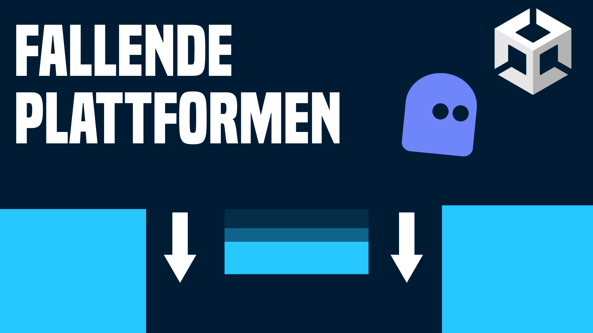

# Fallende Plattformen in Unity 2D

in diesem Video lernst du, verschiedene Möglichkeiten um fallende Plattformen in dein 2D Spiel einzubauen. 

- [🎬 YT Tutorial]()
- [💬 Joint unserem Discord Server](https://discord.gg/kusy4JQ4)
- [👍 Abonniert um keine Videos zu verpassen](https://www.youtube.com/@prezipgames)

## Viel Spaß beim Entwickeln!
